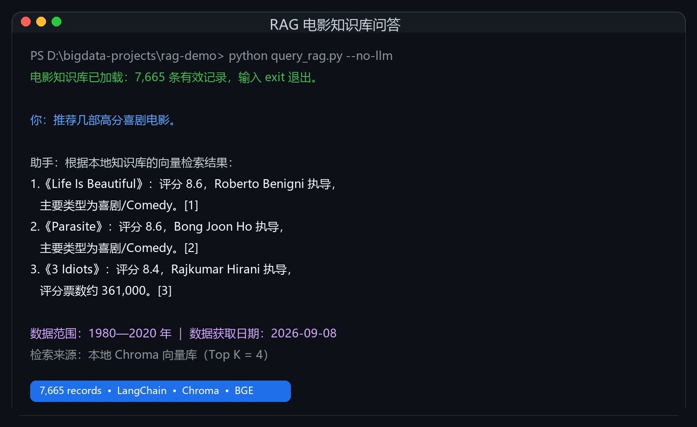

# RAG 知识库问答 Demo

## 项目概述

基于 LangChain + Chroma，将清洗后的电影数据构建为本地向量知识库，实现“数据加载 → 文本切片 → 向量化 → 检索 → LLM 生成”的最小 RAG 闭环。回答被约束为仅使用本地检索结果，降低大模型脱离数据编造答案的风险。


## 为什么做这个

企业级 RAG 系统的核心瓶颈不只在模型，更在于**数据质量**。本项目使用电影数据模拟“业务数据 → 知识库 → 大模型问答”的完整链路，验证了：

- 结构化数据（CSV / 数仓表）如何转换为可检索的非结构化向量知识
- HTML 标签、重复记录和异常字段等数据问题如何影响检索召回效果
- 知识库时效性如何由数据源和采集日期控制，而非受限于模型训练数据

这个 Demo 是**大数据 ETL 能力在 AI 应用层的延伸**：上游关注数据清洗与质量，下游通过向量检索和大模型生成验证数据价值。

## 数据来源

仓库内置 **7,665 条清洗后的电影记录**，由公开的 `movie-stats` 数据集加工而来。原始数据由数据集作者采集自 IMDb，覆盖 **1980—2020 年**，包含评分、评分人数、国家、类型、导演、编剧、主演、制作公司、预算、票房和片长等字段。数据于 **2026-09-08** 从作者的公开 GitHub 仓库获取。

> 说明：这批数据不是本站实时抓取结果，也不包含剧情原文。`summary` 是根据结构化字段生成的事实摘要，避免把不存在的剧情介绍包装成爬取结果。数据仅用于学习和作品集演示。

- 原始记录：7,668 条
- 清洗后记录：7,665 条
- 过滤记录：3 条（核心字段缺失）
- 原始文件 SHA256：`326de5c5a57e12ac241f23ffd06ab06eff576c99077e1992bc229ce9c806f732`
- 数据来源：[danielgrijalva/movie-stats](https://github.com/danielgrijalva/movie-stats)

### CSV 字段

| 字段 | 含义 |
| --- | --- |
| title / year | 片名 / 上映年份 |
| country / genres | 国家地区 / 主要类型（中英双语） |
| rating / votes | IMDb 用户评分 / 评分人数 |
| director / writer / actors | 导演 / 编剧 / 主要演员 |
| company / runtime_min | 制作公司 / 片长 |
| budget_usd / gross_usd | 预算 / 全球票房（美元） |
| summary | 基于结构化字段生成的事实摘要 |
| crawl_date / source_url | 获取日期 / 可追溯来源 |

### 重新获取和加工数据

```bash
# 联网下载公开原始数据并生成标准 movies.csv
python fetch_movie_data.py

# 已有 data/movies_source.csv 时，仅执行本地清洗转换
python fetch_movie_data.py --use-local
```

## 技术链路

```text
电影数据（CSV）
  → pandas 清洗、去重、异常值过滤
  → RecursiveCharacterTextSplitter 文本切片
  → BGE 中文 Embedding
  → Chroma 本地向量库
  → 用户 Query 相似度检索
  → OpenAI-compatible LLM 基于上下文生成答案
```

## 项目结构

```text
rag-demo/
├── README.md
├── requirements.txt
├── .env.example
├── config.py                    # 从环境变量读取配置，不保存密钥
├── fetch_movie_data.py         # 公开数据下载、清洗与字段标准化
├── build_knowledge_base.py      # CSV → 清洗 → 切片 → 向量库
├── query_rag.py                 # Query → 检索 → LLM/本地结果
├── demo_screenshot.png
└── data/
    ├── movies_source.csv        # 公开原始数据（7,668 条）
    └── movies.csv               # 清洗后的知识库数据（7,665 条）
```

## 快速体验

```bash
pip install -r requirements.txt
python build_knowledge_base.py   # 首次需下载 Embedding 模型
python query_rag.py              # 启动交互式问答
```

两种运行模式：

```bash
# 仅检索（不调用 LLM，免费）
python query_rag.py --question "推荐高分喜剧" --no-llm

# 完整 RAG（需要在 .env 中配置 API Key）
python query_rag.py --question "推荐高分喜剧"
```

### 配置大模型（可选）

不配置 API Key 时，程序仍会展示本地向量检索结果。若需要完整的 LLM 生成回答：

```bash
copy .env.example .env          # Windows
# cp .env.example .env          # Linux / macOS
```

然后在 `.env` 中填写 `OPENAI_API_KEY`。如使用兼容 OpenAI 接口的其他模型服务，同时设置 `OPENAI_BASE_URL` 与 `LLM_MODEL`。

## 运行效果



示例问题：`推荐几部高分喜剧电影。`

系统先从本地 Chroma 召回电影片段，再要求模型只根据这些片段作答并标注来源。知识库的时效性由 CSV 的采集日期控制，而不是依赖通用模型训练数据的截止时间。

## 数据质量处理

构建脚本包含以下质量规则：

- 校验 CSV 必需字段，缺字段时直接失败并提示
- 统一数值字段并清理不可见字符与连续空白
- 过滤片名、年份或评分缺失，以及评分超出 0～10 的记录
- 按“片名 + 年份”去重，并输出原始、有效、过滤记录数
- 为类型和主要国家增加中英双语标签，改善中文问题的检索召回
- 记录数据来源 URL、获取日期和原始文件 SHA256，保证可追溯
- API Key 仅从 `.env` 读取，向量库与密钥文件均不提交 Git

## 踩坑记录

**问题：英文结构化字段对中文查询召回不友好。** 原始数据中的国家和类型使用英文，例如 `Comedy`、`United States`。直接向量化后，中文问题的匹配不够稳定。加工脚本为常见国家和类型增加中英双语标签，并把评分、导演、主演、票房等字段组织成统一事实摘要。这样既保留原始信息，又提升了中文查询的召回效果。

## 后续计划

- 增加 RAGAS/自定义问题集，评估命中率、忠实度和回答相关性
- 增加 FastAPI 接口和简单 Web UI，支持在线演示
